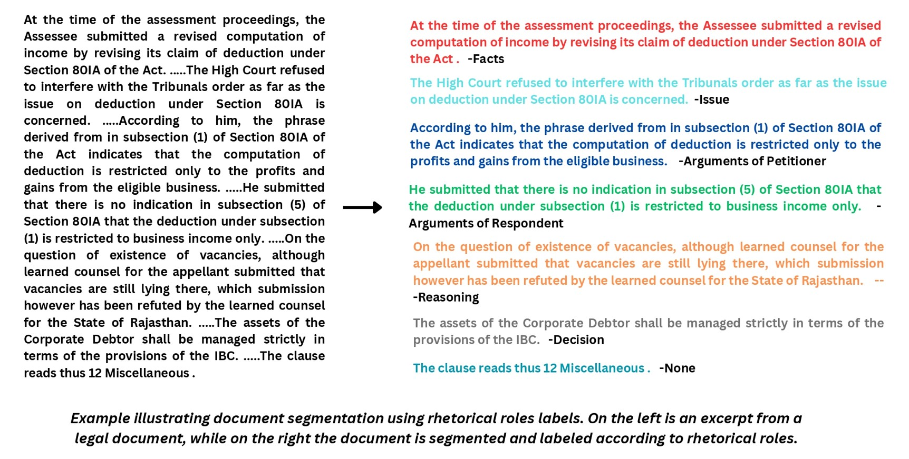
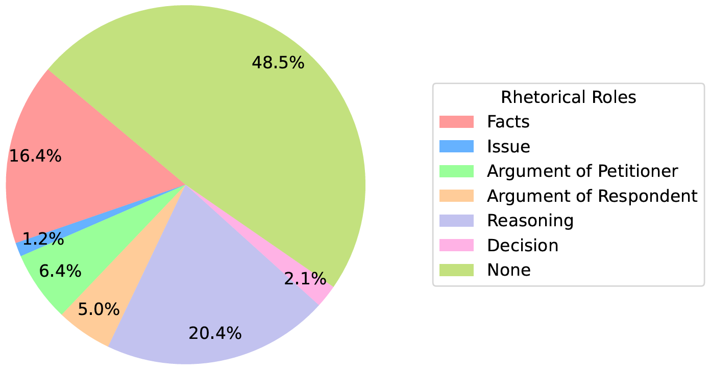

# LegalSeg: Unlocking the Structure of Indian Legal Judgments Through Rhetorical Role Classification
In this paper, we address the task of semantic segmentation of legal documents through rhetorical role classification, with a focus on Indian legal judgments. We introduce **LegalSeg**, the largest annotated dataset for this task, comprising over 7,000 documents and 1.4 million sentences, labeled with 7 rhetorical roles. To benchmark performance, we evaluate multiple state-of-the-art models, including Hierarchical BiLSTM-CRF, TransformerOverInLegalBERT (ToInLegalBERT), Graph Neural Networks (GNNs), and Role-Aware Transformers, alongside an exploratory **RhetoricLLaMA**, an instruction-tuned large language model. Our results demonstrate that models incorporating broader context, structural relationships, and sequential sentence information outperform those relying solely on sentence-level features. Additionally, we conducted experiments using surrounding context and predicted or actual labels of neighboring sentences to assess their impact on classification accuracy. Despite these advancements, challenges persist in distinguishing between closely related roles and addressing class imbalance. Our work underscores the potential of advanced techniques for improving legal document understanding and sets a strong foundation for future research in legal NLP.
<h1 align="center">

<br>
LegalSeg: Unlocking the Structure of Indian Legal Judgments Through Rhetorical Role Classification
</h1>





<p align="center">
  <a href="https://huggingface.co/L-NLProc"><b>[🌐 Website]</b></a> •
  <a href=><b>[📜 Proceedings]</b></a> •
  <a href="https://arxiv.org/abs/2502.05836"><b>[📜 ArXiv]</b></a> •
  <a href="https://huggingface.co/collections/L-NLProc/legalseg-models-67b8b42b5e1b74491fec8345"><b>[🤗 HF Models]</b></a> •
  <a href="https://github.com/ShubhamKumarNigam/LegalSeg"><b>[ GitHub]</b></a> •
  <a href="https://forms.gle/PaUDZNgVi78R4WLK7"><b>[📝 Google Form to request dataset access]</b></a> 
</p>

<p align="center">
  This is the official implementation of the paper:
</p>
<p align="center">
  <a href="https://arxiv.org/abs/2502.05836">LegalSeg: Unlocking the Structure of Indian Legal Judgments Through Rhetorical Role Classification
</a> (to appear in <strong>[NAACL 2025](https://2025.naacl.org/)</strong>)
</p>
<p align="center">
 <b>Authors:</b> <a href="https://sites.google.com/view/shubhamkumarnigam">Shubham Kumar Nigam</a>, <a href="https://www.linkedin.com/in/tanmay-dubey-6062a3205/">Tanmay Dubey </a>, <a href="https://www.linkedin.com/in/govind-sharma-0374251b2/">Govind Sharma</a>, <a href="#">Noel Shallum</a>, <a href="https://sites.google.com/view/kripabandhughosh-homepage/home">Kripabandhu Ghosh</a>, and <a href="https://www.cse.iitk.ac.in/users/arnabb/">Arnab Bhattacharya</a>:
</p>

If you have any questions on this work, please open a [GitHub issue](https://github.com/ShubhamKumarNigam/LegalSeg/issues) or email the authors at

```shubhamkumarnigam@gmail.com```

The pie chart below shows the distribution of Rhetorical Roles with in the Dataset.



## Citation
If you use this project in your research or other work, please cite it as follows:
```
@article{nigam2025legalseg,
  title={LegalSeg: Unlocking the Structure of Indian Legal Judgments Through Rhetorical Role Classification},
  author={Nigam, Shubham Kumar and Dubey, Tanmay and Sharma, Govind and Shallum, Noel and Ghosh, Kripabandhu and Bhattacharya, Arnab},
  journal={arXiv preprint arXiv:2502.05836},
  year={2025}
}

